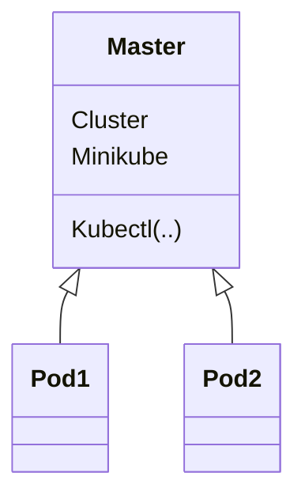
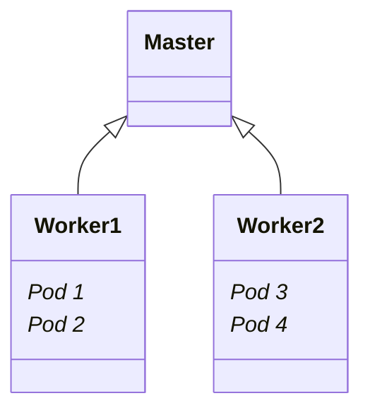
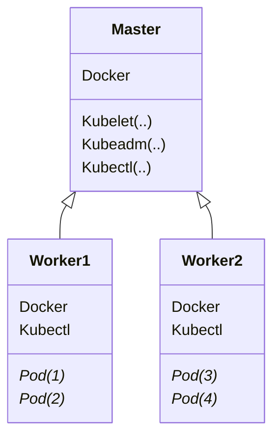

# Analize concept small k8s platform

## Platform Minikube

 You start the cluster using ```minikube start```, wait a few minutes and your kubectl is ready to go. To specify a Kubernetes version you can use the ```--kubernetes-version``` flag.

### WM



## Platform Kind

Creating a cluster is very similar to minikube’s approach. Executing kind ```create cluster```, playing the waiting game and afterwards you are good to go. By using ```different names (--name)``` kind allows you to create multiple instances in parallel.

One feature that I personally enjoy is the ability to load my local images directly into the cluster. This saves me a few extra steps of setting up a registry and pushing my image each and every time I want to try out my changes. With a simple ```kind load docker-image my-app:latest``` the image is available for use in my cluster.

### Nodes



## Platform K3d

  K3d is the alternative to Kubeadm. Utility designed to easily run multi-node K3s clusters in Docker.
  The application is split into the K3d server and the agent. The former acts as a manager while the latter is responsible for handling the actual workload. I discourage you from running them on your workstation as this leads to some cluster in your local filesystem. Instead put K3d in a container (e.g. by using rancher/K3d) which also allows you to easily run several independent instances.

### WM cluster



One feature that stands out is called auto deployment. It allows you to deploy your Kubernetes manifests and Helm charts by putting them in a specific directory. K3d watches for changes and takes care of applying them without any further interaction. This is especially useful for CI pipelines and IoT devices (both target use cases of K3d). Just create/update your configuration and K3d makes sure to keep your deployments up to date.

### Table compare parameters

<table>
  <tr>
    <th> </th>
    <th>minikube</th>
    <th>kind</th>
    <th>K3d</th>
  </tr>
  <tr>
    <td>runtime</td>
    <td>VM</td>
    <td>container</td>
    <td>native</td>
  </tr>
  <tr>
    <td>supported architectures</td>
    <td>AMD64</td>
    <td>AMD64</td>
    <td>AMD64, ARMv7, ARM64</td>
  </tr>
  <tr>
    <td>supported container runtimes</td>
    <td>Docker,CRI-O,containerd,gvisor</td>
    <td>Docker</td>
    <td>Docker, containerd</td>
  </tr>
  <tr>
    <td>startup time initial/following</td>
    <td>5:19 / 3:15</td>
    <td>2:48 / 1:06</td>
    <td>0:15 / 0:15</td>
  </tr>
  <tr>
    <td>memory requirements</td>
    <td>2GB</td>
    <td>8GB (Windows, MacOS)</td>
    <td>512 MB</td>
  </tr>
  <tr>
    <td>requires root?</td>
    <td>no</td>
    <td>no</td>
    <td>yes </td>
  </tr>
  <tr>
    <td>multi-cluster support</td>
    <td>yes</td>
    <td>yes</td>
    <td>no (can be achieved using containers)</td>
  </tr>
  <tr>
    <td>multi-node support</td>
    <td>no</td>
    <td>yes</td>
    <td>yes</td>
  </tr>
  <tr>
    <td>project page</td>
    <td><a href="https://minikube.sigs.k8s.io/">minikube</a></td>
    <td><a href="https://kind.sigs.k8s.io/">kind</a></td>
    <td><a href="https://k3d.io/">K3d</a></td>
  </tr>
</table>

### Demonstration


### Alternatives Minikube

*microk8s* - An upstream Kubernetes distribution made for operations on IoT and edge computing devices in remote locations. It is optimized for IoT and edge computing resource constraints.

*kind* (Kubernetes in Docker) - Tool for running local Kubernetes clusters using Docker containers as nodes. It is primarily designed for testing Kubernetes itself.

*k0s* - Extremely lightweight Kubernetes distribution created specifically for edge computing workloads with minimal resource usage.

*kubeadm* - Official Kubernetes tool for installing vanilla Kubernetes distributions. It is used by many Kubernetes vendors and initiatives under the hood.

*Rancher Desktop* - All-in-one Kubernetes distribution for developer desktops. It includes Rancher's user-friendly management GUI and a full Docker desktop runtime.

*Charmed Kubernetes* - Canonical's enterprise-grade Kubernetes management platform for production infrastructure.

*Oracle Container Engine for Kubernetes* - Oracle's public cloud Kubernetes offering which can be run locally using tools like Oracle VM VirtualBox.

*Red Hat CodeReady Containers* - OpenShift-based Kubernetes distribution with features like easy cluster provisioning, simple network configurations, persistent volumes, integrated container registry and more.

*Docker Desktop* - Popular option for running Kubernetes locally. The version included is typically a bit behind the latest but has native Docker engine integration.
