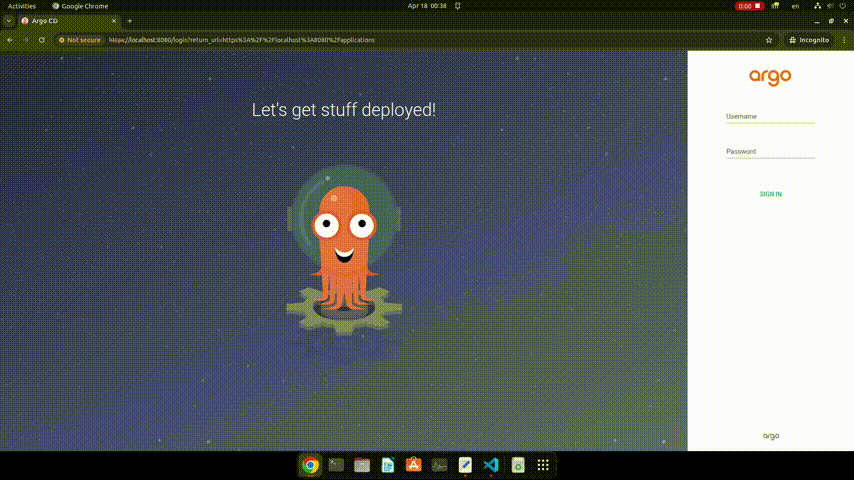

# Proof of concept

## GitHub

create a scripts/application.yaml in repository project AsciiArtify

## Minikube cluster

For demonstration PoC we use minikube.
```curl -Lo minikube https://storage.googleapis.com/minikube/releases/latest/minikube-linux-amd64 && chmod +x minikube```
```sudo install minikube /usr/local/bin/```
```minikube start```


## ArgoCD
```minikube cluster create argo```
```kubectl create namespace argocd```
```kubectl cluster-info```
```kubectl get all -A```
```kubectl apply -n argocd -f https://raw.githubusercontent.com/argoproj/argo-cd/v2.8.4/manifests/install.yaml```
```kubectl get po -n argocd -w```
```kubectl get all -n argocd```
```kubectl port-forward svc/argocd-server -n argocd 8080:443```
After this we ready to use web UI argoCD. For getting password we should use command: 
```kubectl -n argocd get secret argocd-initial-admin-secret -o jsonpath="{.data.password}" | base64 -d; echo```

### Short demo how to use Web UI ArgoCD

## Deploy image

```minikube service web --url```
```curl http://192.168.49.2:31552```